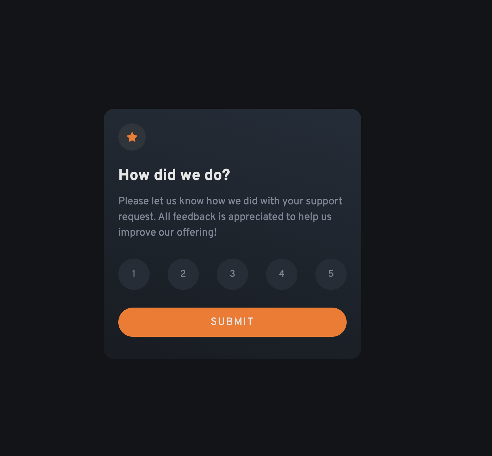

# Frontend Mentor - Interactive rating component solution

This is a solution to the [Interactive rating component challenge on Frontend Mentor](https://www.frontendmentor.io/challenges/interactive-rating-component-koxpeBUmI). Frontend Mentor challenges help you improve your coding skills by building realistic projects.

## Table of contents

- [Overview](#overview)
  - [The challenge](#the-challenge)
  - [Screenshot](#screenshot)
  - [Links](#links)
- [My process](#my-process)
  - [Built with](#built-with)
  - [What I learned](#what-i-learned)
  - [Continued development](#continued-development)

**Note: Delete this note and update the table of contents based on what sections you keep.**

## Overview

### The challenge

Users should be able to:

- View the optimal layout for the app depending on the device's screen size
- See hover states for all interactive elements on the page
- Select and submit a number rating
- See the "Thank you" card state after submitting a rating

### Screenshot

### Links

- Solution URL: [Frontend Mentor](https://www.frontendmentor.io/solutions/interactive-rating-card-with-dom-manipulation-and-flexbox-E2-ef9dhcR)
- Live Site URL: [Live URL](fem-interactive-ratings-bmm.netlify.app)

## My process

### Built with

- Semantic HTML5 markup
- CSS custom properties
- Flexbox
- Mobile-first workflow
- JS DOM manipulation

### What I learned

During this challenge, I learned how to use the forEach() method to iterate over the list of rating buttons. By doing this in a few different ways, I was able to add a selection class after a click, clear any DOM-added classes when you click off a button to remove your selection, and pull the value to add to the thank you card.

### Continued development

I need to continue learning and practicing JavaScript. I was able to talk out my process with pseudo-coding. The execution of this needs a little refinement from me. This will come with continued practice.
